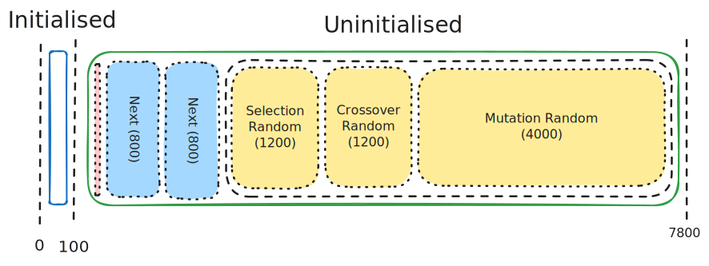

# knapsack-ga-wasm
Genetic algorithm solving the knapsack problem, written in WebAssembly Text Format.

## Run it yourself

This program was run and tested using [`wasmtime`](https://github.com/bytecodealliance/wasmtime) v38.

```
wasmtime knapsack.wat
```

## Docs: Memory Usage

Here is a not-entirely-to-scale diagram of the contents of my program's linear memory:



The intialised portion is hardcoded, and is filled when the program is first loaded.
It contains the scenario data and the printable strings `: ` and `\n`.
It only contains 33 bytes of data, but has 100 bytes of space in case I need to add more.

The uninitialised portion is filled programmatically.
1. The section in contains buffers for the I/O functions.
2. `population` is a massive array containing pairs of genomes and fitnesses.
3. `next` has the same structure as `population`, except that its fitnesses are never filled.

At the beginning of the program, `population` is filled with random numbers,
seeding the individuals for the first generation.
The segment indicated by the dashed line is called `randomSegment`.
It contains three arrays used to make random decisions throughout the program.
To reduce overheads, these three arrays are filled all at once with a single call to `wasi_unstable::random_get`.

4. `selectionRandom` is used in three `u16`s to select the individuals in each tournament.
5. `crossoverRandom` is used in two parts:
    1. A `u16` to decide whether or not crossing over will occur.
    2. A `u32` to fairly decide the crossing point.
6. `mutationRandom` is used as 10 `u16`s to decide whether or not to flip each of the 10 bits in a genome.
