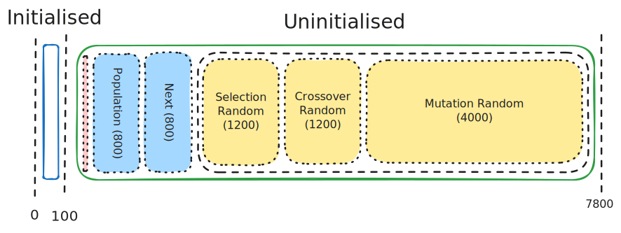
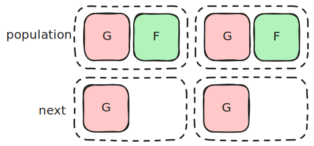

# Knapsack Documentation

## Parameters

You can adjust several characteristics about the genetic algorithm to see how they affect finding the solution and solution convergence:
- `$generationCount` - Total run time of the program. If you're failing to find a solution consistently, try upping this until you do, so you can see how the other factors are impacting performance. Default is 20.
- `$arenaCount` - Number of individuals per tournament. Larger number causes your GA to converge on a solution faster. Default is 3.
- `$crossoverThreshold` - Chance out of 65536 of crossover occurring. Default is 52428 (80%).
- `$mutationThreshold` - Chance out of 65536 of each bit in a genome mutating. Default is 655 (1%).

These values are stored in global constants found in lines `57`-`60`.

## Style Guide

- Variables are `snakeCase`.
- Functions are `CamelCase`.
- Use assembly-style expressions over S-expressions.
- Document functions using Go-style method signatures.

## Linear Memory

Here is a not-entirely-to-scale diagram of the contents of Knapsack's linear memory:



The intialised portion is hardcoded, and is filled when the program is first loaded.
It contains the scenario data, and the strings needed to output valid CSV.

Starting at `200` is the uninitialised portion, which is filled as the program runs.
1. A small set of buffers used by `$Print` and `$Itoa`.
2. `population` - the current individuals and their fitnesses.
3. `next` - space for the next generation to be stored.
4. `selectionRandom` - random numbers used to decide which individuals are selected for the tournaments.
5. `crossoverRandom` - random numbers used to decide whether or not crossing over occurs, and at what point.
6. `mutationRandom` - random numbers used to decide which bits to flip during mutation.

At the beginning of the program, `population` is filled with random bytes, generating the intial population.
Each generation, `selectionRandom`, `crossoverRandom`, and `mutationRandom` are filled with random bytes, providing the randomness for that generation.

## `population` and `next`

The `population` and `next` segments are both nominally arrays of `[]Individual`:

```go
type Individual struct {
    Genome uint16
    Fitness uint16
}
```

In `population`, both fields are filled. However, in `next`, only the `Genome` is filled:

.

If space was the primary concern, it would make the most sense to use `[]uint16` to store the next population. In this case, speed is the primary concern, so by padding out `next` we can use `memory.copy` to copy `next` into `population` much faster than using loads and stores to do it.

## Random Data

The three random data segments - `selectionRandom`, `crossoverRandom`, and `mutationRandom` - collectively pointed to by `randomSegment` are filled with random data at the start of each generation. These are used to make decisions like the crossover point or choosing to mutate a particular bit.

The random segments are best described as arrays:

```go
// Three individuals selected per arena
var selectionRandom [][3]uint16

type CrossoverRandom struct {
    CrossingChance uint16
    CrossingPoint uint32
}
// One crossing chance and one crossing point per pair
var crossoverRandom []CrossoverRandom

// 10 bits to mutate
var mutationRandom [][10]uint16
```

Some of the functions under Index are used to get pointers into these arrays of random data, so that each time a decision needs to be made, it uses a fresh piece of random data.

An alternate way of handling this task would be using something in the style of a [bump allocator](https://en.wikipedia.org/wiki/Region-based_memory_management) to apportion out random data on demand from a buffer.
